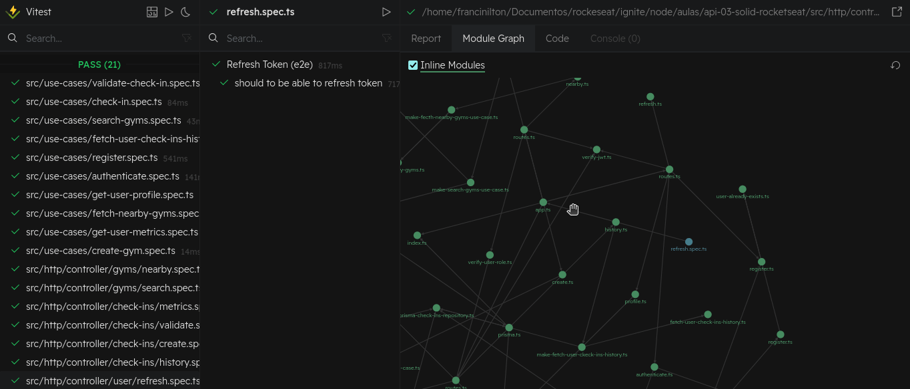
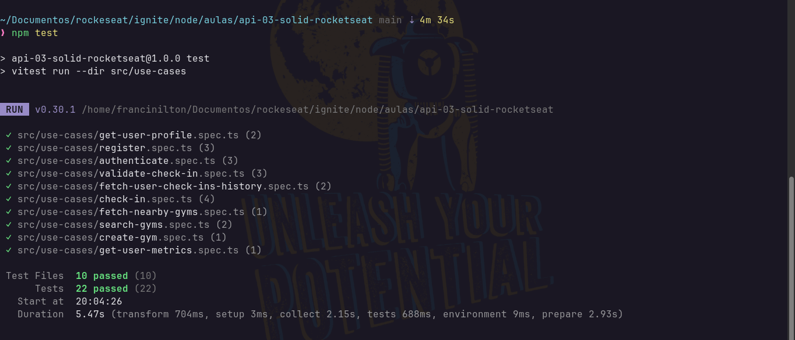

<h2 align="center">
  <div>
    
  </div>
</h2>

<h1 align="center">
  API Node.js com SOLID | GymPass API REST 💻🚀 
 <h1>

 
<h1 align="center">
  <div style="display: flex; flex-direction: row;">
    
    
  </div>
</h1>

API REST desenvolvida no módulo Ignite da Rocketseat. O projeto utiliza conceitos de clean architecture, factory pattern, autenticação JWT e geolocalização.

A aplicação GymPass tem como objetivo gerenciar o tráfego de clientes em academias. Os usuários podem realizar o check-in nas academias, porém o check-in só é permitido se o usuário estiver a uma distância de até 100 metros da academia.


<h2 id="technologies"> 🛠 Tecnologias utilizadas: </h2>

  - `prisma`: ORM para banco de dados.
  - `supertest`: Testes de API.
  - `tsup`: Compilação TypeScript.
  - `tsx`: Suporte para TSX.
  - `typescript`: Linguagem de programação.
  - `vitest`: Ferramenta de teste.
  - `fastify`: Framework web (Fastify).
  - `zod`: Validação de dados (Zod).

## RFs (Requisitos funcionais)

- [x] Deve ser possível se cadastrar;
- [x] Deve ser possível se autenticar;
- [x] Deve ser possível obter o perfil de um usuário logado;
- [x] Deve ser possível obter o número de check-ins realizados pelo usuário logado;
- [x] Deve ser possível o usuário obter o seu histórico de check-ins;
- [x] Deve ser possível o usuário buscar academias próximas (até 10km);
- [x] Deve ser possível o usuário buscar academias pelo nome;
- [x] Deve ser possível o usuário realizar check-in em uma academia;
- [x] Deve ser possível validar o check-in de um usuário;
- [x] Deve ser possível cadastrar uma academia;

## RNs (Regras de negócio)

- [x] O usuário não deve poder se cadastrar com um e-mail duplicado;
- [x] O usuário não pode fazer 2 check-ins no mesmo dia;
- [x] O usuário não pode fazer check-in se não estiver perto (100m) da academia;
- [x] O check-in só pode ser validado até 20 minutos após ser criado;
- [x] O check-in só pode ser validado por administradores;
- [x] A academia só pode ser cadastrada por administradores;

## RNFs (Requisitos não-funcionais)

- [x] A senha do usuário precisa estar criptografada;
- [x] Os dados da aplicação precisam estar persistidos em um banco PostgreSQL;
- [x] Todas listas de dados precisam estar paginadas com 20 itens por página;
- [x] O usuário deve ser identificado por um JWT (JSON Web Token);

<h2 id="usage" > 👷 Requisitos </h2>

Install git, node and yarn (or npm).

```bash
# Clone Repository
$ git clone https://github.com/franciniltonsoaresmenzes/api-03-solid-rocketseat.git

# Go to server folder
$ cd api-03-solid-rocketseat 

# Install Dependencies
$ npm install


# rename file .env.example to .env

# run docker compose
$ docker compose up -d

# run prisma
$ npx prisma migrate dev

# Run Tests
$ npm run test
$ npm run test:e2e
```
